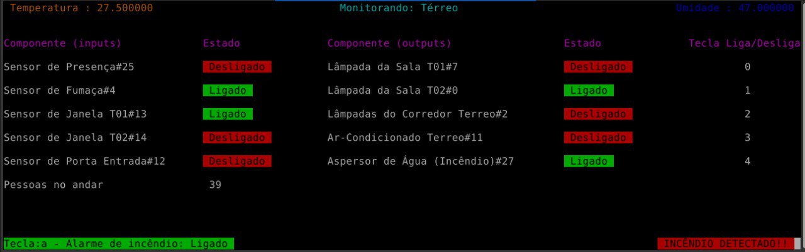

# FSE-Trabalho-2
Repositório dedicado ao segundo trabalho da disciplina de Fundamentos de Sistemas Embarcados.

## Enunciado

O enunciado do trabalho pode ser encontrado [aqui](https://gitlab.com/fse_fga/trabalhos-2021_2/trabalho-2-2021-2)

## Como rodar

Com os arquivos já na rasp, utilize o seguinte comando para servidores distribuidos:
### __1 - Distribuidos:__
#### __Compilar__
Para compilar, na raiz do projeto, utilize o seguinte comando:
 
##### `make`
 
#### __Executar__:

Para executar, utilize o seguinte comando:  

__Andar térreo:__
* ##### `make run-terreo`

__Andar 1:__
* ##### `make run-a1`

### __2 - Central:__
#### __Executar__:

Para executar, utilize o seguinte comando:  

* ##### `python3 main.py`

## ScreenShots
#### Térreo

  

#### Andar 1

  

